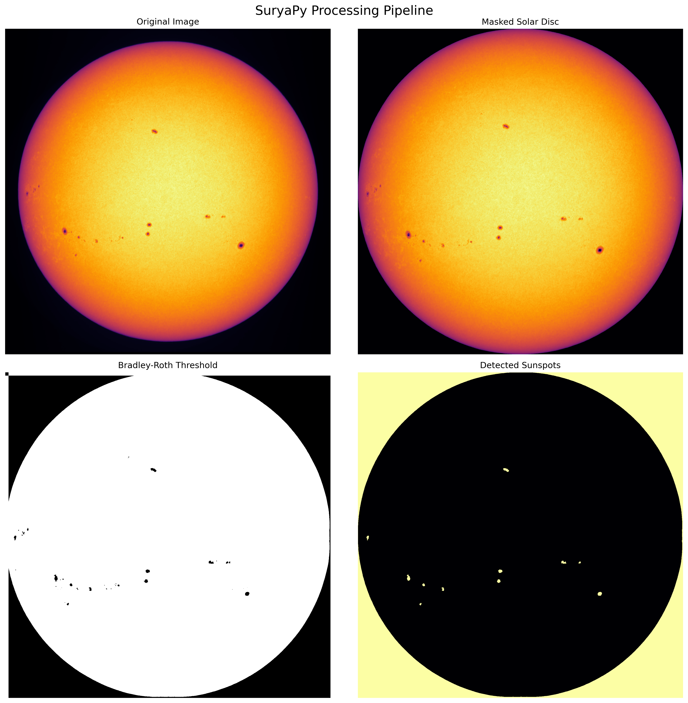
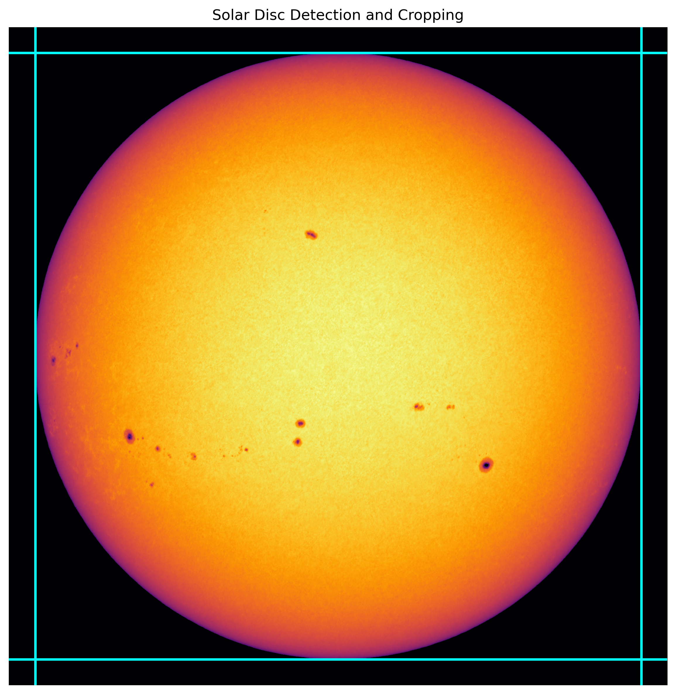
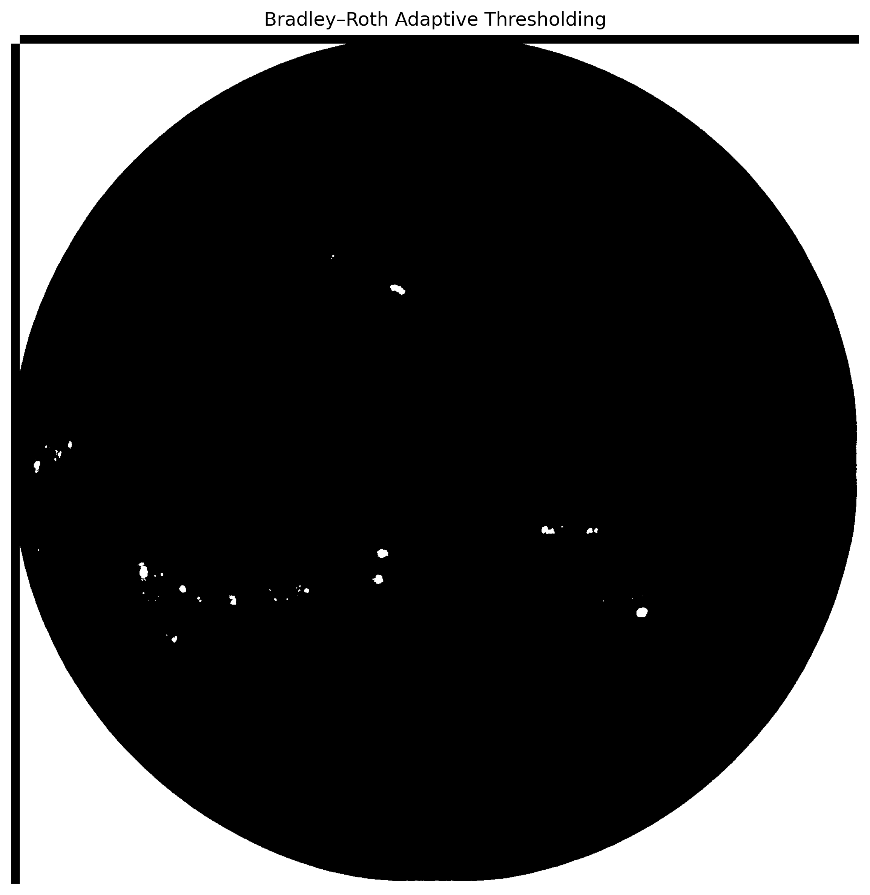
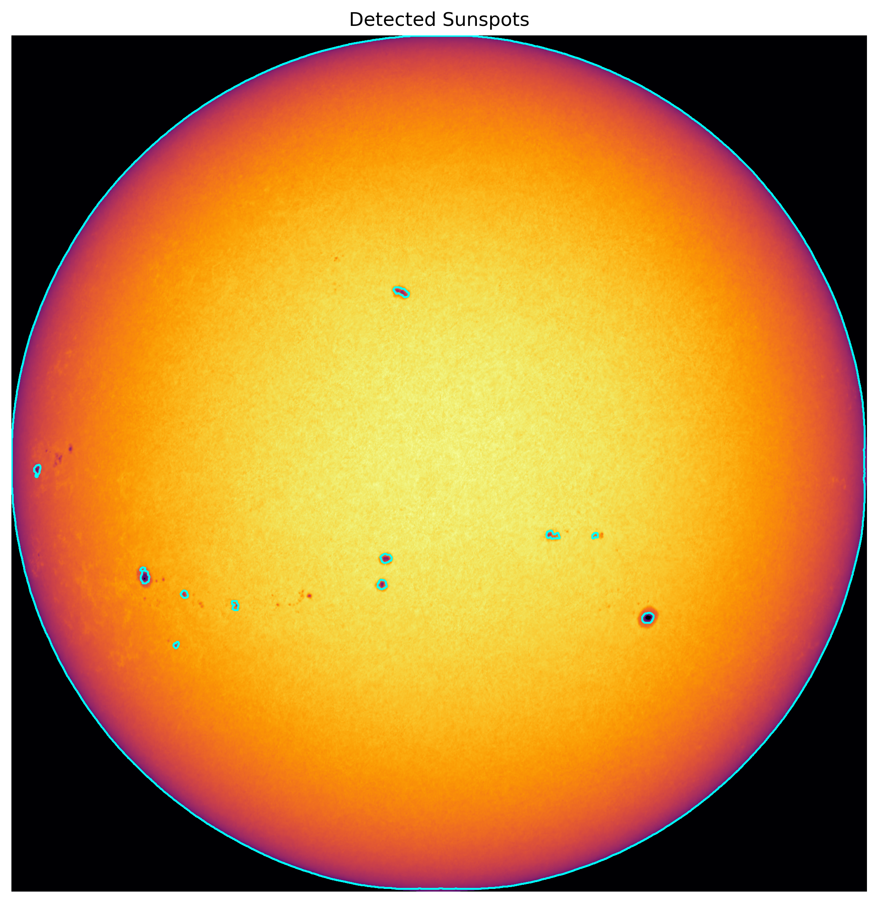

How It Works
=============

SuryaPy was developed during the Astro Lab Summer Internship 2024 as a lightweight toolkit for analysing solar images and detecting sunspots.

The package combines image preprocessing, adaptive thresholding, connected-component analysis, and geometric corrections into a simple scientific workflow.

Processing Pipeline
-------------------

The typical workflow is:

1. Load a solar image
2. Detect and crop the solar disc
3. Apply adaptive thresholding
4. Identify connected sunspot regions
5. Estimate physical sunspot areas
6. Apply projection corrections

Solar Disc Detection
--------------------

Solar images often contain large regions of dark background sky.

Before detecting sunspots, SuryaPy isolates the solar disc using a simple threshold mask.

The boundaries of the Sun are identified using row and column averages of the mask.

This reduces noise and limits further processing to the solar surface itself.

Bradley–Roth Adaptive Thresholding
----------------------------------

A central part of SuryaPy is the Bradley–Roth adaptive thresholding algorithm.

Unlike a global threshold, adaptive thresholding computes a local intensity average around every pixel using an integral image.

This makes the method more robust to:

- uneven illumination
- limb darkening
- brightness gradients
- observational noise

The implementation follows:

Bradley, D. & Roth, G. (2007). *Adaptive Thresholding using the Integral Image.*

Dark regions in the thresholded mask correspond to candidate sunspot regions.

Connected-Component Analysis
----------------------------

After thresholding, SuryaPy identifies individual sunspot regions using connected-component analysis from ``scipy.ndimage``.

Morphological operations help remove small noisy detections and fill gaps within larger spots.

Each connected region can then be measured individually.

Area Estimation
---------------

For every detected component, the package estimates:

- area in pixels
- bounding dimensions
- centroid coordinates

The package also includes utilities for converting pixel areas into:

- km²
- millionths of the solar hemisphere (MH)

Projection and Foreshortening Corrections
-----------------------------------------

Sunspots near the solar limb appear compressed due to projection effects.

SuryaPy includes geometric correction utilities that compensate for this distortion using heliocentric coordinates.

The correction follows:

.. math::

   A_{corrected} =
   \frac{A_{observed}}
   {\sqrt{1 - (y/R)^2 - (z/R)^2}}

where:

- :math:`A_{observed}` is the measured image area
- :math:`R` is the solar radius
- :math:`y, z` are heliocentric coordinates

Scientific Applications
-----------------------

SuryaPy can be used for:

- educational astronomy projects
- solar image analysis
- sunspot area estimation
- long-term solar activity studies
- preprocessing pipelines for solar datasets

The project is still under active development and new functionality may continue to be added.
