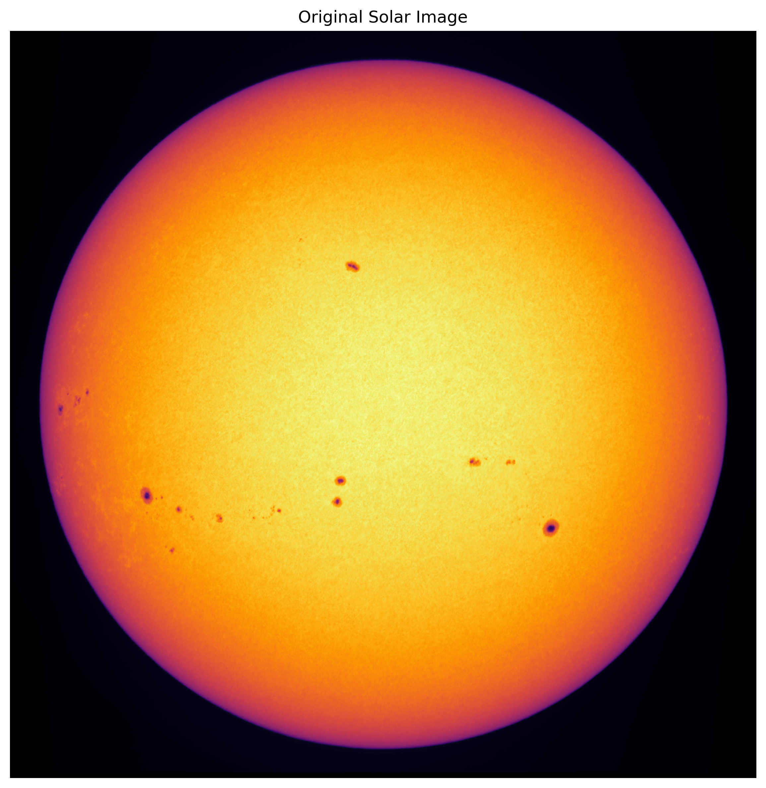
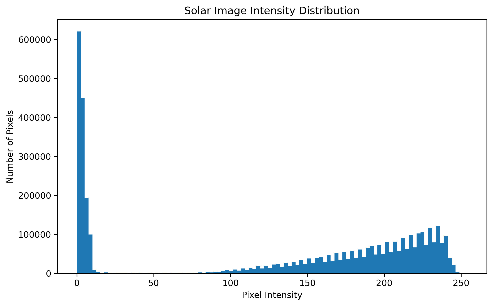
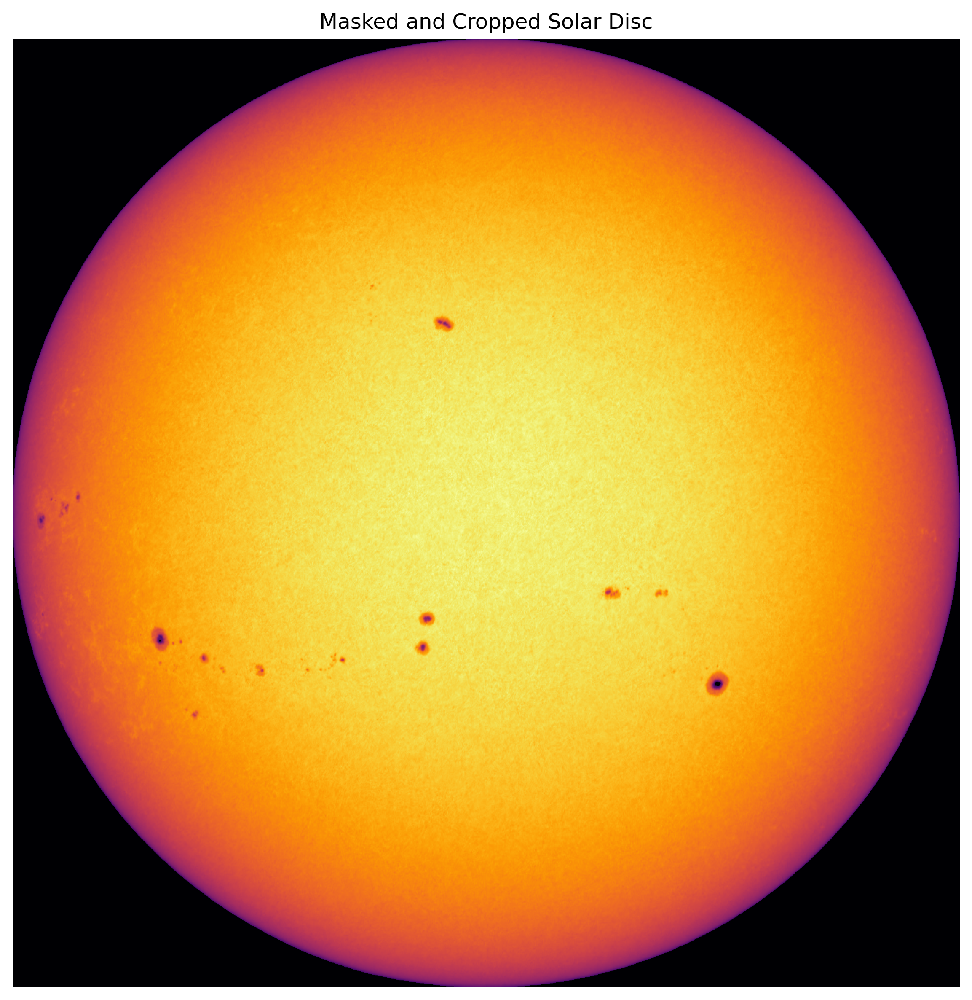
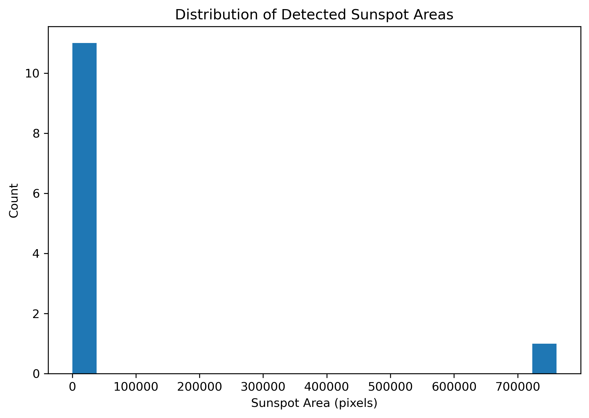

Quick Tutorial
===============

This tutorial walks through the complete SuryaPy workflow using a solar image.  
We will:

1. Load a solar image
2. Detect and crop the solar disc
3. Apply Bradley–Roth adaptive thresholding
4. Detect sunspots using connected-component analysis
5. Estimate sunspot areas

The examples below follow the same processing pipeline used during the Astro Lab Summer Internship 2024.

Prerequisites
--------------

Install SuryaPy:

.. code-block:: bash

   pip install suryapy

Import the required functions:

.. code-block:: python

   import matplotlib.pyplot as plt

   from suryapy import (
       mask_sun,
       b_roth,
       find_components,
   )

Loading a Solar Image
----------------------

We begin by loading a solar image.

.. code-block:: python

   image = plt.imread("solar_image.jpg")

   # Convert RGB image to grayscale if needed
   if image.ndim == 3:
       image = image.mean(axis=2)

   # Scale JPG images if values are between 0 and 1
   if image.max() <= 1:
       image = image * 255

   plt.figure(figsize=(8,8))
   plt.imshow(image, cmap="inferno")
   plt.title("Original Solar Image")
   plt.axis("off")

The original image contains the full solar disc along with the surrounding sky background.

Pixel Intensity Distribution
----------------------------

Before thresholding, it is useful to examine the intensity distribution of the image.

.. code-block:: python

   plt.figure(figsize=(8,5))

   plt.hist(image.flatten(), bins=100)

   plt.xlabel("Pixel Intensity")
   plt.ylabel("Number of Pixels")
   plt.title("Solar Image Intensity Distribution")

The histogram helps separate the bright solar disc from the dark background sky.

Solar Disc Detection and Cropping
---------------------------------

The next step is to isolate the solar disc from the background.

SuryaPy uses a simple masking approach to identify the boundaries of the Sun before cropping the image.

.. code-block:: python

   cropped = mask_sun(
       image,
       sun_threshold=50,
       print_log=False,
   )

   plt.figure(figsize=(8,8))
   plt.imshow(cropped, cmap="inferno")
   plt.title("Masked Solar Disc")
   plt.axis("off")

.. image:: images/solar_disc_detection.png
   :width: 700px
   :align: center

The cyan lines indicate the detected boundaries of the solar disc.

After masking and cropping, the analysis focuses only on the Sun itself.

Bradley–Roth Adaptive Thresholding
----------------------------------

To isolate dark sunspots under uneven illumination conditions, SuryaPy implements the Bradley–Roth adaptive thresholding algorithm.

Unlike a global threshold, adaptive thresholding calculates a local mean intensity around each pixel using an integral image.

.. code-block:: python

   br_mask = b_roth(
       cropped,
       threshold=10,
       Nx=100,
       print_log=False,
   )

   plt.figure(figsize=(8,8))
   plt.imshow(br_mask, cmap="binary")
   plt.title("Bradley–Roth Thresholding")
   plt.axis("off")

.. image:: images/bradley_roth_clean.png
   :width: 700px
   :align: center

Dark regions correspond to candidate sunspots detected by the adaptive thresholding algorithm.

Connected-Component Analysis
----------------------------

Once the thresholded mask has been created, SuryaPy identifies individual sunspot regions using connected-component analysis from ``scipy.ndimage``.

Small noisy detections can be filtered using a minimum area threshold.

.. code-block:: python

   (
       labeled_image,
       num_components,
       large_components_mask,
       component_sizes,
       bound_box,
   ) = find_components(
       br_mask,
       cropped,
       min_size=100,
       print_log=False,
   )

   print(f"Detected components: {num_components}")

.. image:: images/detected_sunspots_overlay.png
   :width: 700px
   :align: center

The detected sunspot regions are overlaid on the original solar image.

Sunspot Area Distribution
-------------------------

The detected regions can be analysed statistically.

.. code-block:: python

   valid_sizes = component_sizes[component_sizes > 100]

   plt.figure(figsize=(7,5))

   plt.hist(valid_sizes, bins=20)

   plt.xlabel("Sunspot Area (pixels)")
   plt.ylabel("Count")

   plt.title("Distribution of Detected Sunspot Areas")

This provides a simple way to study the distribution of sunspot sizes within an observation.

Complete Processing Pipeline
----------------------------

The full SuryaPy workflow is summarised below.

.. image:: images/suryapy_pipeline.png
   :width: 850px
   :align: center

Summary
-------

In this tutorial, we:

- Loaded a solar image
- Isolated the solar disc
- Applied Bradley–Roth adaptive thresholding
- Detected connected sunspot regions
- Analysed sunspot area distributions

These tools form the core processing pipeline of SuryaPy and can be extended for tracking, correction, and long-term solar activity analysis.
